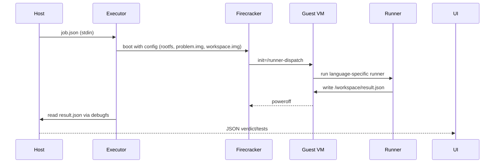

# CoderLab — Unified Multi‑Language Judge
> An end‑to‑end, LeetCode/CodeSignal‑style coding judge you can run locally or in prod (Docker or Firecracker).

---

## 🔭 What you get

- **Frontend (React + Vite)** — simple UI to select a problem, choose a language, code, and run.
- **Backend (Go)** — REST API to list problems and submit code; invokes the executor.
- **Executor (Rust)** — *two options*:
  - **Demo stub (included here):** works out of the box to prove the pipeline without sandbox deps.
  - **Hardened sandbox (separate build)**: Docker **or** Firecracker microVM with timeouts, structured logs, and Prometheus textfile metrics.
- **Runners** (Python/C++/SQLite) — compile/run + grade solutions inside the sandbox or guest VM.
- **Problem bundles** — examples for Python/C++ (`float-mean`) and SQL (`top-customers-sql`).

> ⚠️ This zip includes the **demo executor stub** for instant local runs. For a production‑grade sandbox, swap in the **metrics+Firecracker** executor build (instructions below).

---

## 🗺️ Architecture (high‑level)

```mermaid
flowchart LR
  UI[React UI] -->|POST /api/submit| API(Go Backend)
  API -->|stdin job.json| EXE(Rust Executor)
  subgraph Sandbox
    direction LR
    DKR[Docker Container]:::gray OR FC[Firecracker microVM]:::gray
  end
  EXE <-- optional --> Sandbox
  Sandbox -->|/workspace/result.json\n(stdout JSON)| EXE
  EXE --> API --> UI

  classDef gray fill:#f2f2f2,stroke:#999,stroke-width:1px,color:#333
```

**Data paths**
- Problem assets → mounted read‑only inside the sandbox/VM.
- Candidate code → mounted read‑write to capture `result.json`.

**Result contract**
```json
{
  "verdict": "Accepted|WrongAnswer|RE|TLE|IE",
  "tests": [{"name":"public/01","status":"AC","time_ms":7,"message":""}],
  "compile_log": "...",
  "run_log": "..."
}
```

---

## 📁 Repository layout

```
coderlab-unified/
├─ backend/                     # Go server
│  └─ cmd/server/main.go
├─ frontend/                    # React + Vite UI
│  ├─ index.html
│  └─ src/{App.jsx,main.jsx}
├─ executor-rs/                 # Rust executor (stub in this pack)
│  └─ src/main.rs
├─ runner-images/               # Docker runners (prod mode) + scripts
│  ├─ python/{Dockerfile,runner.py}
│  ├─ cpp/{Dockerfile,runner.sh}
│  └─ sqlite/{Dockerfile,runner_sqlite.py}
├─ vm/guest/                    # Firecracker guest (prod mode)
│  ├─ build-rootfs.sh
│  └─ runner-dispatch
└─ data/problems/
   ├─ float-mean/               # Python/C++ sample
   │  ├─ manifest.json
   │  └─ v1/{public,checker}
   └─ top-customers-sql/        # SQL sample
      ├─ manifest.json
      └─ v1/sql/public/{000.db,000.out}
```

---

## 🚀 Quickstart (2–3 minutes, demo mode)

This runs the whole flow **without Docker/Firecracker** using the minimal executor stub.

1) **Backend (Go 1.22+)**
```bash
cd backend
go run ./cmd/server
# → listens on http://localhost:8080
```

2) **Frontend (Node 18+)**
```bash
cd frontend
npm i
npm run dev
# → http://localhost:5173 (proxies /api to :8080)
```

3) Open the UI, select **“Mean of N Floats”**, keep language as **Python**, click **Run**.  
You should see a result like **Accepted** with one public test.

> The demo executor prints a canned result to validate UI/API wiring. Continue below for **real grading**.

---

## 🧪 Real grading with Docker (local dev / CI)

This mode runs user code inside minimal Docker images (no Firecracker needed).

1) **Build runner images**
```bash
docker build -t coderlab-runner-python:latest  ./runner-images/python
docker build -t coderlab-runner-cpp:latest     ./runner-images/cpp
docker build -t coderlab-runner-sqlite:latest  ./runner-images/sqlite
```

2) **Swap in the full executor (recommended)**
- Option A (if you downloaded the “metrics+firecracker” pack): copy its `executor-rs/` over this one.
- Option B (build from source yourself): use the Firecracker/metrics variant you prefer.

3) **Build executor**
```bash
cd executor-rs
cargo build --release
```

4) **Run backend with Docker mode**
```bash
export EXECUTOR_MODE=docker
cd backend
go run ./cmd/server
```

5) **Run frontend**
```bash
cd frontend
npm run dev
```

Submit a solution from the UI; the executor will:
- Start the language runner container with **no network**.
- Mount the **problem bundle** read‑only and **submission** dir read‑write.
- Emit the **runner JSON** back to the backend/UI.

**Troubleshooting**
- `docker: not found` → install Docker Desktop / engine.
- `unsupported lang` → ensure `language` matches your runner image names.

---

## 🛡️ Production‑grade isolation with Firecracker (microVM)

> Best choice for untrusted code at scale. Requires Linux with KVM and an uncompressed `vmlinux` kernel.

### 1) Build the **guest rootfs** (once)
```bash
cd vm/guest
sudo ./build-rootfs.sh
# → creates vm/guest/rootfs.ext4 (Debian minimal with Python, g++, sqlite3, jq)
export FC_ROOTFS="$(pwd)/rootfs.ext4"
export FC_KERNEL="/path/to/vmlinux"    # uncompressed, virtio enabled
```

### 2) Use the **full executor** (not the demo stub)
- Copy in the hardened `executor-rs/` (Firecracker + timeouts + metrics) and build:
```bash
cd executor-rs
cargo build --release
```

### 3) Run backend with Firecracker mode
```bash
export EXECUTOR_MODE=firecracker
export FC_KERNEL=/abs/path/to/vmlinux
export FC_ROOTFS=/abs/path/to/vm/guest/rootfs.ext4

# Optional observability
export EXECUTOR_BUDGET_MS=15000         # kill-on-budget for VM/runner
export EXECUTOR_KILL_GRACE_MS=1000
export METRICS_TEXTFILE_DIR=/var/lib/node_exporter/textfile_collector

cd backend
go run ./cmd/server
```

### 4) Frontend
```bash
cd frontend && npm run dev
```

### How it works


**Security notes**
- Read‑only problem image; read‑write workspace.
- No networking in the VM.
- Use jailer + cgroups + seccomp on Firecracker in prod.
- Validate kernel and rootfs checksums.

---

## 🧩 Backend API

- `GET /api/problems` → list problems
- `GET /api/problem/{id}` → one problem (title, statement, languages, stub)
- `POST /api/submit`
  ```jsonc
  {
    "problemId": "float-mean",
    "language": "python", // or "cpp" | "sql"
    "files": {
      "Main.py": "print('hello')"
    }
  }
  ```
  Returns: runner JSON (see contract above).

**Curl example**
```bash
curl -s -XPOST localhost:8080/api/submit \
 -H 'Content-Type: application/json' \
 -d '{"problemId":"float-mean","language":"python","files":{"Main.py":"print(2.0)"}}' | jq
```

---

## ⚙️ Environment variables

| Var | Purpose | Default |
|---|---|---|
| `EXECUTOR_MODE` | `docker` \| `firecracker` \| *(stub uses current)* | `docker` (backend default) |
| `EXECUTOR_BUDGET_MS` | Global execution budget | `15000` |
| `EXECUTOR_KILL_GRACE_MS` | Delay after kill before finalize | `1000` |
| `FC_KERNEL` | Path to uncompressed kernel | *(required in FC mode)* |
| `FC_ROOTFS` | Path to guest ext4 image | *(required in FC mode)* |
| `METRICS_TEXTFILE_DIR` | Prometheus textfile output dir | *(off if empty)* |

---

## 🧱 Adding a new problem

1) Create a folder `data/problems/<id>/v1/`  
2) Add `manifest.json`:
```json
{
  "id": "two-sum",
  "title": "Two Sum",
  "statement": "Given n and an array, print indices i j...",
  "languages": ["python","cpp"],
  "stub": {
    "python": "print('TODO')",
    "cpp": "// TODO"
  }
}
```
3) Add tests under `v1/public/*.in` and `*.out`.  
4) (Optional) Add `v1/checker/checker.py` for tolerance/partial credit.

**Checker contract** (stdin = candidate output; argv: `<in> <out>`), must print:
```json
{"ok": true, "message": ""}
```

---

## 🧰 Local dev tips

- Frontend proxies `/api` to `:8080` (see `vite.config.js`).
- In Docker mode, the executor spawns containers **without network**.
- In Firecracker mode, artifacts are built under `/tmp/coderlab-fc-<submission_id>` on the host.

---

## 🩺 Troubleshooting

| Symptom | Fix |
|---|---|
| `docker: command not found` | Install Docker and ensure your user can run it. |
| `firecracker not found` | Install Firecracker and put it in `$PATH`. |
| `FC_KERNEL not set` | Provide a valid uncompressed `vmlinux`. |
| VM boots but no result | Check `runner-dispatch` and that the runner exists for the chosen language. |
| WrongAnswer but looks correct | Whitespace newlines matter unless checker tolerates; trim output or add a checker. |
| SQL results mismatch | Compare normalized CSVs; ensure `ORDER BY` is deterministic. |

---

## 📦 Production checklist

- Use the **hardened executor** (Docker/Firecracker with timeouts + metrics).
- Pin runner image digests; keep images minimal.
- Configure **node_exporter** textfile collector to pick up metrics.
- Add **request/trace ID** → set `EXECUTOR_SPAN_ID` for correlation.
- Quarantine temp dirs; scrub artifacts after grading.
- Resource limits: cgroups (CPU/mem/pids/io), UIDs/GIDs in guest, seccomp/Jailer.

---

## 📝 License

MIT. Use at will.
