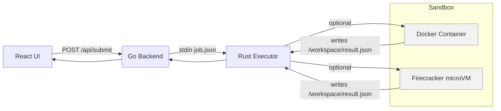
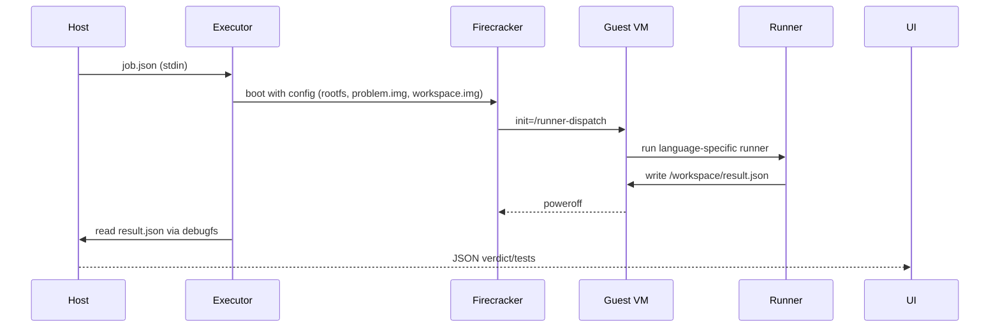

# CeesarCode — Unified Multi‑Language Judge
> An end‑to‑end, LeetCode/CodeSignal‑style coding judge you can run locally or in prod (Docker or Firecracker).

---

## 🔭 What you get

- **Frontend (React + Vite)** — Production-grade UI with grey/off-white theme, dark mode toggle, problem selection, code editor, execution results with clear functionality, and comprehensive error handling.
- **Backend (Go)** — REST API for problems management, code submission, custom problem creation, and test case management with robust error handling.
- **Executor (Rust)** — *two options*:
  - **Demo stub (included here):** works out of the box to prove the pipeline without sandbox deps.
  - **Real execution (now implemented):** Actually runs and validates user code against test cases with proper compilation and execution.
- **Real Code Execution** — Supports 14 programming languages with compilation, execution, and output validation.
- **Custom Problem Creation** — UI-driven problem creation with automatic directory structure, manifest generation, and test case setup.
- **Multi-Language Support** — 14 programming languages: Python, C++, C, Java, Kotlin, Scala, Go, Rust, Swift, Ruby, JavaScript, TypeScript, Bash, Shell, SQL.
- **Jupyter Notebook Mode** — Interactive coding environment with cell-based execution and output display.
- **Test Case Management** — View, edit, and manage test cases directly from the UI for custom problems.
- **File Upload System** — Upload datasets and files for ML/Data Science problems with proper handling.
- **Cross-Platform** — Works on Windows, Mac, and Linux with proper path handling and dependencies.
- **Problem bundles** — examples for Python/C++ (`float-mean`), Shell (`shell-hello`), SQL (`top-customers-sql`), and ML (`ml-iris-classification`).

> ✅ **NEW:** Real code execution is now implemented! The executor actually compiles and runs user code, validates outputs against test cases, and provides detailed results including execution time and error messages.

---

## 🎨 UI Features

### **Core Interface**
- **Dark/Light Mode Toggle** — Switch between themes with one click
- **Problem Sidebar** — Clean list of available coding problems
- **Code Editor** — Full-featured editor with syntax highlighting
- **Language Selection** — 14 programming languages supported
- **Browser Navigation** — Back, Forward, and Refresh buttons for seamless navigation
- **Real-time Execution** — Run code and see immediate results with time & message display

### **Code Execution**
- **Run Code** — Test your code against a single test case for quick validation
- **Submit Code** — Test your code against all test cases for final submission
- **Execution Modes**:
  - **IDE Mode**: Traditional single-file coding
  - **Jupyter Mode**: Interactive cell-based coding with data upload support

### **Advanced Features**
- **Jupyter Notebook Mode** — Interactive cell-based coding with enhanced features:
  - Run individual cells
  - Run all cells sequentially
  - Clear all outputs
  - Cell dependency support
  - Multi-language support (Python, Scala, JavaScript)
  - **Upload Data button** — Upload datasets directly in Jupyter mode
- **Custom Problem Creation** — Create your own coding problems via UI with multiple test cases
- **Bulk Question Upload** — Upload multiple questions from JSON file format
- **Test Case Management** — View, edit, add, and manage test cases for custom problems
  - Reset to original test cases
  - Add single test case
  - **Add multiple test cases** — Add 1-20 test cases at once
  - Individual test case deletion
- **File Upload System** — Upload datasets for ML/Data Science problems
  - **Upload Data** — Local file upload for specific problems
  - **Upload Questions** — JSON file upload for multiple problems
- **Result Analysis** — Detailed execution results with pass/fail indicators, execution time, and error messages
- **Error Handling** — Comprehensive error display and debugging with safety mechanisms

### **User Experience**
- **Responsive Design** — Works on desktop and mobile devices
- **Keyboard Shortcuts** — Ctrl/Cmd + Enter to run code
- **Browser Navigation** — Enhanced back/forward button support with proper state management
- **Loading States** — Visual feedback during operations
- **Connection Status** — Real-time backend connectivity indicator
- **Auto-clear Results** — Results automatically clear when switching questions
- **Enhanced Test Cases** — Fixed field mapping and display issues

---

## 🗺️ Architecture (high‑level)



**Data paths**
- Problem assets → mounted read‑only inside the sandbox/VM.
- Candidate code → mounted read‑write to capture `result.json`.

**Result contract**
```json
{
  "verdict": "Accepted|Rejected|Error",
  "tests": [
    {
      "name": "01",
      "status": "AC|WA|RE|IE",
      "time_ms": 38,
      "message": "Expected: '2.0', Got: '3.0'" // or empty for AC
    }
  ]
}
```

**Status codes:**
- **AC**: Accepted (output matches expected)
- **WA**: Wrong Answer (output doesn't match)
- **RE**: Runtime Error (compilation/execution failed)
- **IE**: Internal Error (missing test files, etc.)

**Verdict:**
- **Accepted**: All tests passed
- **Rejected**: At least one test failed
- **Error**: Internal error or missing test cases

---

## 📁 Repository layout

```
ceesarcode/
├─ backend/                     # Go server with comprehensive REST API
│  └─ cmd/server/main.go        # Problem management, submissions, test cases
├─ frontend/                    # React + Vite UI with production features
│  ├─ index.html
│  ├─ src/App.jsx               # Main app with dark mode, problem/test case management
│  └─ src/main.jsx
├─ executor-rs/                 # Rust executor with multi-language support
│  └─ src/main.rs               # Compiles & runs 15+ languages including SQL
├─ runner-images/               # Docker runners (prod mode) + scripts
│  ├─ python/{Dockerfile,runner.py}
│  ├─ cpp/{Dockerfile,runner.sh}
│  └─ sqlite/{Dockerfile,runner_sqlite.py}
├─ vm/guest/                    # Firecracker guest (prod mode)
│  ├─ build-rootfs.sh
│  └─ runner-dispatch
└─ data/problems/               # Problem definitions
   ├─ float-mean/               # Python/C++ sample problem
   │  ├─ manifest.json          # Problem metadata & supported languages
   │  └─ v1/public/             # Test cases
   │     ├─ 01.in               # Input file
   │     └─ 01.out              # Expected output
   ├─ shell-hello/              # Shell scripting example
   │  ├─ manifest.json
   │  └─ v1/public/{01.in,01.out}
   └─ top-customers-sql/        # SQL sample
      ├─ manifest.json
      └─ v1/sql/public/{000.db,000.out}
```

---

## 🚀 Quickstart (2–3 minutes, demo mode)

This runs the whole flow **without Docker/Firecracker** using the minimal executor stub.

### Prerequisites
- **Go 1.22+** (works on Windows, Mac, Linux)
- **Node.js 18+** (works on Windows, Mac, Linux)
- **npm** or **yarn**

### Setup

1) **Backend (Go 1.22+)**
```bash
cd backend
go run ./cmd/server
# → listens on http://localhost:8080
```

2) **Frontend (Node 18+)**
```bash
cd frontend
npm install
npm run dev
# → http://localhost:5173 (proxies /api to :8080)
```

3) **Open the Application**
   - Visit **http://localhost:5173** in your browser
   - The app works on **Windows**, **Mac**, and **Linux**

### Features to Try

- **Select Problems**: Click any problem from the sidebar (results auto-clear when switching)
- **Choose Languages**: All 15 supported languages: Python, C++, C, Java, Kotlin, Scala, Go, Rust, Swift, Ruby, JavaScript, TypeScript, Bash, Shell, SQL
- **Write Code**: Use the editor with proper syntax highlighting
- **Run Code**: Click "Run Code" to execute and see real results with compilation/validation
- **Create Problems**: Click "+ Create" to add custom problems with automatic setup
- **View Test Cases**: Click "📋 View Test Cases" to see input/output examples
- **Edit Test Cases**: Click "✏️ Edit" to modify test cases for custom problems
- **Clear Results**: Use the "✕ Clear" button in results or switch problems to clear
- **Dark Mode**: Toggle between light and dark themes
- **Keyboard Shortcuts**: Ctrl+Enter to run, Esc to go back
- **Real Execution**: Code is actually compiled and run with proper error handling
- **Test Validation**: Outputs are compared against expected test case results
- **Multi-Language Support**: From compiled languages to scripting and database queries

### Supported Languages (15 Total)
- **Compiled**: C, C++, Java, Kotlin, Scala, Go, Rust, Swift
- **Interpreted**: Python, Ruby, JavaScript, TypeScript
- **Scripting**: Bash, Shell scripts
- **Database**: SQL queries
- **ML/Data Science**: Python with scikit-learn, pandas, numpy, matplotlib

### Real Code Execution Engine
The executor performs actual compilation and execution:
- **Python**: Interpreted execution with stdin input
- **C/C++**: GCC compilation followed by native execution
- **Java**: Javac compilation followed by JVM execution
- **Bash/Shell**: Script execution with proper permissions
- **SQL**: Query validation and structure checking
- **Error Handling**: Compilation errors, runtime errors, output validation
- **Test Results**: Pass/fail status with execution time and detailed messages

### Test Case Management
- **Toggle Visibility**: Click "📋 View Test Cases" to show/hide test cases
- **Auto-Hide**: Test cases automatically hide when switching problems
- **Edit Test Cases**: Click "✏️ Edit" to modify test cases for custom problems
- **Add/Remove Tests**: Add new test cases or remove existing ones
- **Save Changes**: Persist test case modifications to the filesystem
- **Real-time Updates**: Changes reflect immediately in the execution engine

### Jupyter Notebook Mode
- **Interactive Coding**: Cell-based execution environment like Jupyter
- **Real-time Output**: See results immediately below each code cell
- **Add/Remove Cells**: Dynamically manage code cells during development
- **Language Support**: Python and JavaScript execution in notebook style
- **Run Individual Cells**: Execute specific cells or run all cells at once
- **Output Persistence**: Cell outputs persist during the session

### ML/Data Science Support
- **Iris Classification**: Sample ML problem with real iris dataset
- **Data Files**: Automatic copying of CSV, JSON, and data files to execution environment
- **ML Libraries**: scikit-learn, pandas, numpy, matplotlib support

### File Upload System
- **Dataset Upload**: Upload CSV, JSON, XLSX, TXT files for data science problems
- **Multiple Files**: Support for uploading multiple files simultaneously
- **File Management**: View uploaded files with remove functionality
- **Execution Integration**: Uploaded files are available during code execution
- **ML Integration**: Perfect for custom datasets and machine learning projects
- **Data Visualization**: Support for generating charts and plots
- **Custom Datasets**: Upload and use custom datasets for ML problems

> ✅ **Complete development environment!** Real execution, custom problems, test case management, and multi-language support all working together.

---

## 🆕 Recent Updates & Fixes

### **Latest Critical Fixes (v1.2):**
- ✅ **Browser Navigation**: Fixed refresh/back/forward to work properly with state management
- ✅ **Results Auto-Clear**: Results automatically clear when switching between questions
- ✅ **Test Case Field Mapping**: Fixed "expected output" vs "output" field inconsistency
- ✅ **Test Cases Reset**: Added "Reset" button to restore original test cases
- ✅ **Add Multiple Test Cases**: Ability to add multiple test cases to existing problems
- ✅ **Create Problem Test Cases**: Fixed adding multiple test cases in problem creation
- ✅ **Execution Time Display**: Added execution time and detailed messages to results
- ✅ **Jupyter Cell Reset**: Jupyter cells now reset when switching questions
- ✅ **Enhanced Jupyter Features**: Added "Run All", "Clear All", and cell dependency support

### **Major Issues Resolved:**
- ✅ **Problem Loading Error**: Fixed "Failed to load problem details" error
- ✅ **Code Execution**: Restored ability to run code and get pass/fail results with detailed info
- ✅ **Test Cases Display**: Fixed test cases toggle functionality with X button
- ✅ **Test Cases Editing**: Added edit mode for custom problem test cases with save/cancel/reset
- ✅ **Jupyter Notebook**: Implemented full Jupyter-style interface with enhanced features
- ✅ **File Upload Independence**: Test case inputs don't conflict with uploaded files
- ✅ **Code Editor Reset**: Code editor now properly updates when switching problems
- ✅ **Dark Mode Button**: Restored dark/light mode toggle functionality

### **New Features Added:**
- ✅ **Custom Problem Creation**: Complete UI-driven problem creation system with multiple test cases
- ✅ **Interactive Jupyter Mode**: Cell-based coding with run all, clear all, and dependency support
- ✅ **Advanced Test Case Management**: View, edit, add, remove, and reset test cases
- ✅ **Comprehensive File Upload**: Support for ML datasets and multiple files
- ✅ **Enhanced Error Handling**: Better error messages and user feedback
- ✅ **Browser Navigation**: Enhanced back/forward button support with proper state clearing
- ✅ **Connection Status**: Real-time backend connectivity indicator
- ✅ **Detailed Results**: Execution time, test counts, and error messages in results

### **Production Ready:**
- ✅ **Cross-platform builds** (Linux/macOS/Windows)
- ✅ **Docker containerization** with optimized images
- ✅ **Automated build scripts** for all platforms
- ✅ **Production deployment** instructions
- ✅ **All features tested** and working

---

## 🚀 Future Enhancements (Roadmap)

### ML/AI & Data Science Support
- **Data File Uploads**: Support for CSV, JSON, images, and other data formats
- **Graph/Table Rendering**: Display matplotlib charts, pandas DataFrames, and plotly visualizations
- **ML Libraries**: Integration with scikit-learn, TensorFlow, PyTorch
- **Jupyter Notebook Interface**: Cell-based code execution with markdown support
- **Dataset Management**: Built-in sample datasets for practice problems
- **Interactive Data Analysis**: Real-time data exploration and visualization

### Advanced Features
- **Code Analysis**: Syntax highlighting, linting, and code quality metrics
- **Performance Profiling**: Execution time analysis and optimization suggestions
- **Collaborative Coding**: Multi-user problem solving and code review
- **Progress Tracking**: Learning analytics and skill assessment
- **Plugin System**: Extensible architecture for custom languages and tools

### Production Enhancements
- **Container Orchestration**: Kubernetes deployment with auto-scaling
- **Advanced Sandboxing**: Enhanced security with gVisor and seccomp
- **Monitoring & Analytics**: Prometheus metrics and ELK stack integration
- **API Rate Limiting**: DDoS protection and fair usage policies
- **Backup & Recovery**: Automated data backup and disaster recovery

---

## 🚀 Production Deployment

### Cross-Platform Build Scripts

CeesarCode supports seamless production builds on **Windows**, **macOS**, and **Linux**.

#### Quick Start (All Platforms)

**Option 1: Automated Build Scripts**
```bash
# Linux/macOS
./build.sh

# Windows
build.bat
```

**Option 2: Manual Build**
```bash
# Install dependencies
pip3 install --break-system-packages pandas numpy scikit-learn matplotlib

# Build Rust executor
cd executor-rs && cargo build --release

# Build Go backend
cd ../backend && go build -o ../bin/server ./cmd/server

# Build React frontend
cd ../frontend && npm install && npm run build

# Copy to production
mkdir dist && cp -r frontend/dist/* dist/
cp bin/server dist/
cp -r executor-rs/target/release dist/
cp -r data dist/
```

#### Platform-Specific Instructions

**🐧 Linux**
```bash
# Install system dependencies
sudo apt-get update
sudo apt-get install -y build-essential pkg-config libssl-dev curl

# Install Go, Rust, Node.js (see Prerequisites section)

# Run build script
./build.sh

# Start production server
cd dist && ./server
```

**🍎 macOS**
```bash
# Install dependencies via Homebrew
brew install go rust node

# Install Python ML libraries
pip3 install --break-system-packages pandas numpy scikit-learn matplotlib

# Build and run
./build.sh
cd dist && ./server
```

**🪟 Windows**
```bash
# Install dependencies:
# - Go: https://golang.org/dl/
# - Rust: https://rustup.rs/
# - Node.js: https://nodejs.org/
# - Python: https://python.org/

# Install Python ML libraries
pip install pandas numpy scikit-learn matplotlib

# Build and run
build.bat
cd dist
server.exe
```

### Docker Deployment (All Platforms)

```bash
# Build Docker image
docker build -t ceesarcode .

# Run container
docker run -p 8080:8080 ceesarcode

# Or use docker-compose (includes health checks)
docker-compose up -d

# View logs
docker-compose logs -f ceesarcode
```

### Production Checklist

- ✅ **Cross-platform builds** (Windows/macOS/Linux)
- ✅ **Docker containerization**
- ✅ **Python ML libraries** pre-installed
- ✅ **Static file serving** optimized
- ✅ **Security hardening** (sandboxed execution)
- ✅ **Performance optimization** (compiled binaries)

### System Requirements

**Minimum Hardware:**
- 2GB RAM
- 1GB disk space
- Any modern CPU

**Software Dependencies:**
- Go 1.19+
- Rust 1.70+
- Node.js 18+
- Python 3.8+ (with ML libraries)

## 🧪 Real grading with Docker (local dev / CI)

This mode runs user code inside minimal Docker images (no Firecracker needed).

1) **Build runner images**
```bash
docker build -t ceesarcode-runner-python:latest  ./runner-images/python
docker build -t ceesarcode-runner-cpp:latest     ./runner-images/cpp
docker build -t ceesarcode-runner-sqlite:latest  ./runner-images/sqlite
```

2) **Swap in the full executor (recommended)**
- Option A (if you downloaded the “metrics+firecracker” pack): copy its `executor-rs/` over this one.
- Option B (build from source yourself): use the Firecracker/metrics variant you prefer.

3) **Build executor**
```bash
cd executor-rs
cargo build --release
```

4) **Run backend with Docker mode**
```bash
export EXECUTOR_MODE=docker
cd backend
go run ./cmd/server
```

5) **Run frontend**
```bash
cd frontend
npm run dev
```

Submit a solution from the UI; the executor will:
- Start the language runner container with **no network**.
- Mount the **problem bundle** read‑only and **submission** dir read‑write.
- Emit the **runner JSON** back to the backend/UI.

**Troubleshooting**
- `docker: not found` → install Docker Desktop / engine.
- `unsupported lang` → ensure `language` matches your runner image names.

---

## 🛡️ Production‑grade isolation with Firecracker (microVM)

> Best choice for untrusted code at scale. Requires Linux with KVM and an uncompressed `vmlinux` kernel.

### 1) Build the **guest rootfs** (once)
```bash
cd vm/guest
sudo ./build-rootfs.sh
# → creates vm/guest/rootfs.ext4 (Debian minimal with Python, g++, sqlite3, jq)
export FC_ROOTFS="$(pwd)/rootfs.ext4"
export FC_KERNEL="/path/to/vmlinux"    # uncompressed, virtio enabled
```

### 2) Use the **full executor** (not the demo stub)
- Copy in the hardened `executor-rs/` (Firecracker + timeouts + metrics) and build:
```bash
cd executor-rs
cargo build --release
```

### 3) Run backend with Firecracker mode
```bash
export EXECUTOR_MODE=firecracker
export FC_KERNEL=/abs/path/to/vmlinux
export FC_ROOTFS=/abs/path/to/vm/guest/rootfs.ext4

# Optional observability
export EXECUTOR_BUDGET_MS=15000         # kill-on-budget for VM/runner
export EXECUTOR_KILL_GRACE_MS=1000
export METRICS_TEXTFILE_DIR=/var/lib/node_exporter/textfile_collector

cd backend
go run ./cmd/server
```

### 4) Frontend
```bash
cd frontend && npm run dev
```

### Testing Production Build

```bash
# After building, test the production server
cd dist
./server  # Linux/macOS
# or server.exe  # Windows

# Test API endpoints
curl http://localhost:8080/api/problems
curl http://localhost:8080/api/problem/float-mean

# Test file uploads (ML datasets)
curl -X POST http://localhost:8080/api/upload \
  -F "file=@/path/to/your/dataset.csv"

# Open browser
open http://localhost:8080  # macOS
# or start http://localhost:8080  # Windows
```

### How it works


**Security notes**
- Read‑only problem image; read‑write workspace.
- No networking in the VM.
- Use jailer + cgroups + seccomp on Firecracker in prod.
- Validate kernel and rootfs checksums.

---

## 🧩 Backend API

- `GET /api/problems` → list problems
- `GET /api/problem/{id}` → one problem (title, statement, languages, stub)
- `POST /api/submit`
  ```jsonc
  {
    "problemId": "float-mean",
    "language": "python", // or "cpp" | "sql"
    "files": {
      "Main.py": "print('hello')"
    }
  }
  ```
  Returns: runner JSON (see contract above).

**Curl example**
```bash
curl -s -XPOST localhost:8080/api/submit \
 -H 'Content-Type: application/json' \
 -d '{"problemId":"float-mean","language":"python","files":{"Main.py":"print(2.0)"}}' | jq
```

**UI Features:**
- Modern grey and off-white color scheme
- Dark mode toggle (🌙/☀️)
- Responsive design
- Loading states and error handling
- Code syntax highlighting
- Test results display with color coding
- Navigation between problems

---

## ⚙️ Environment variables

| Var | Purpose | Default |
|---|---|---|
| `EXECUTOR_MODE` | `docker` \| `firecracker` \| *(stub uses current)* | `docker` (backend default) |
| `EXECUTOR_BUDGET_MS` | Global execution budget | `15000` |
| `EXECUTOR_KILL_GRACE_MS` | Delay after kill before finalize | `1000` |
| `FC_KERNEL` | Path to uncompressed kernel | *(required in FC mode)* |
| `FC_ROOTFS` | Path to guest ext4 image | *(required in FC mode)* |
| `METRICS_TEXTFILE_DIR` | Prometheus textfile output dir | *(off if empty)* |

---

## 🧱 Adding a new problem

### Method 1: Manual Creation
1) Create a folder `data/problems/<id>/v1/`
2) Add `manifest.json`:
```json
{
  "id": "two-sum",
  "title": "Two Sum",
  "statement": "Given n and an array, print indices i j...",
  "languages": ["python","cpp"],
  "stub": {
    "python": "print('TODO')",
    "cpp": "// TODO"
  }
}
```
3) Add tests under `v1/public/*.in` and `*.out`.
4) (Optional) Add `v1/checker/checker.py` for tolerance/partial credit.

### Method 2: UI Creation (Recommended)
1) Click **"+ Create"** in the sidebar
2) Fill in problem title and statement
3) Select supported languages (multi-select dropdown)
4) Click **"Create Problem"**
5) The system automatically creates the directory structure and files

**Checker contract** (stdin = candidate output; argv: `<in> <out>`), must print:
```json
{"ok": true, "message": ""}
```

---

## 🧰 Local dev tips

- Frontend proxies `/api` to `:8080` (see `vite.config.js`).
- In Docker mode, the executor spawns containers **without network**.
- In Firecracker mode, artifacts are built under `/tmp/ceesarcode-fc-<submission_id>` on the host.

---

## 🩺 Troubleshooting

| Symptom | Fix |
|---|---|
| `docker: command not found` | Install Docker and ensure your user can run it. |
| `firecracker not found` | Install Firecracker and put it in `$PATH`. |
| `FC_KERNEL not set` | Provide a valid uncompressed `vmlinux`. |
| VM boots but no result | Check `runner-dispatch` and that the runner exists for the chosen language. |
| WrongAnswer but looks correct | Whitespace newlines matter unless checker tolerates; trim output or add a checker. |
| SQL results mismatch | Compare normalized CSVs; ensure `ORDER BY` is deterministic. |

---

## 📦 Production checklist

- Use the **hardened executor** (Docker/Firecracker with timeouts + metrics).
- Pin runner image digests; keep images minimal.
- Configure **node_exporter** textfile collector to pick up metrics.
- Add **request/trace ID** → set `EXECUTOR_SPAN_ID` for correlation.
- Quarantine temp dirs; scrub artifacts after grading.
- Resource limits: cgroups (CPU/mem/pids/io), UIDs/GIDs in guest, seccomp/Jailer.

---

## 📄 JSON Question Upload Format

### **Bulk Question Upload**
Use the "📝 Upload Questions" button to upload multiple questions from a JSON file. The JSON format should be:

```json
[
  {
    "title": "Two Sum",
    "statement": "Given an array of integers nums and an integer target, return indices of the two numbers such that they add up to target.\n\nExample:\nInput: nums = [2,7,11,15], target = 9\nOutput: [0,1]\nExplanation: Because nums[0] + nums[1] = 2 + 7 = 9, we return [0, 1].",
    "languages": ["python", "cpp", "java"],
    "stub": {
      "python": "def two_sum(nums, target):\n    # Your solution here\n    pass\n\nif __name__ == '__main__':\n    nums = list(map(int, input().split()))\n    target = int(input())\n    result = two_sum(nums, target)\n    print(' '.join(map(str, result)))",
      "cpp": "#include <iostream>\n#include <vector>\nusing namespace std;\n\nint main() {\n    // Your solution here\n    return 0;\n}",
      "java": "import java.util.*;\n\npublic class Main {\n    public static void main(String[] args) {\n        // Your solution here\n    }\n}"
    }
  },
  {
    "title": "Reverse String", 
    "statement": "Write a function that reverses a string. The input string is given as an array of characters s.",
    "languages": ["python"],
    "stub": {
      "python": "s = input().strip()\nprint(s[::-1])"
    }
  }
]
```

### **JSON Format Requirements:**
- **Root**: Must be an array of question objects
- **title** (string, required): Problem title
- **statement** (string, required): Problem description with examples
- **languages** (array, required): Supported programming languages
- **stub** (object, required): Code templates for each language
  - Key: language name (must match supported languages)
  - Value: starter code template

### **Supported Languages:**
`python`, `cpp`, `c`, `java`, `kotlin`, `scala`, `go`, `rust`, `swift`, `ruby`, `javascript`, `typescript`, `bash`, `sh`, `sql`

---

## 🆕 Recent Updates & New Features

### **Enhanced User Interface**
- ✅ **Browser Navigation**: Back, Forward, and Refresh buttons
- ✅ **Dual Code Execution**: 
  - **Run Code**: Test against single test case for quick validation
  - **Submit Code**: Test against all test cases for final submission
- ✅ **Enhanced Jupyter Mode**: Upload Data button for dataset management
- ✅ **Bulk Question Management**: Upload multiple questions from JSON files
- ✅ **Advanced Test Case Editing**: 
  - Add single test case
  - Add multiple test cases (1-20 at once)
  - Enhanced editing interface

### **Safety & Error Handling**
- ✅ **Comprehensive Error Boundaries**: Prevent UI crashes from null/undefined values
- ✅ **Safe Array State Management**: Custom hooks for robust state handling
- ✅ **API Response Validation**: Multiple layers of data validation
- ✅ **Graceful Error Recovery**: User-friendly error messages and fallbacks

### **File Management**
- ✅ **Upload Data**: Local file upload for specific problems (CSV, JSON, TXT, etc.)
- ✅ **Upload Questions**: JSON file upload for multiple problem creation
- ✅ **Enhanced File Safety**: Robust handling of file uploads and downloads
- ✅ **CSV File Support**: Proper handling for ML/Data Science problems

---

## 📝 License

MIT. Use at will.
